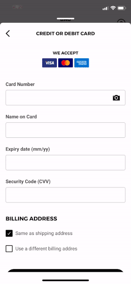

SharkCardScan is a Credit/Debit Card scanner built using Apple's Vision Framework.

SharkCardScan allows you to quickly implement a card scanner inside of your own app. 

SharkCardScan is built and maintained with love by the Gymshark Engineering Team 💙📱


<p align="center">
  
</p>


## Usage

It's possible to get started quickly with the following snippet.

```swift
        let scannerVC = SharkCardScanViewController(viewModel: CardScanViewModel(noPermissionAction: { [weak self] in
            
            self?.showNoPermissionAlert()
            
        }, successHandler: { (response) in
            print("Expiry 💣: \(response.expiry ?? "")")
            print("Card Number 💳: \(response.number)")
            print("Holder name 🕺: \(response.holder ?? "")")
        }))
        
```

Here we handle the No Camera Permission error, from the `ViewModel`and our successHandler is called upon receipt of finding a card number, and the expiry and card holders name, albeit, we can call success if only a valid card number is found.

## Styling

`SharkCardScanViewController` initialiser takes a default parameter for styling, which you can specify your own, if you wish to amend fonts/colours.

``` SharkCardScanViewController(viewModel: CardScanViewModel{...}, styling: MyOwnCardScannerStyling())```

`CardScanStyling ` is a protocol, your styling struct must conform too with the following properties you have to set;

```swift

public protocol CardScanStyling {
    var instructionLabelStyling: LabelStyling { get set }
    var cardNumberLabelStyling: LabelStyling { get set }
    var expiryLabelStyling: LabelStyling { get set }
    var holderLabelStyling: LabelStyling { get set }
    var backgroundColor: UIColor { get set }
}

```

NB: By using the default parameter, and using our `DefaultStyling` struct instance, the font will only have fixed sizes, for now, rather than being dynamic - one for us to fix later (or send us a PR?!)


## Other Customisations

A`CardScanViewModel` has a `instructionText` property, if you wish to override the default instruction text that is shown on the viewer.


## Installation
**Swift Package Manager (SPM)**
To install SharkCardScan using [Swift Package Manager](https://github.com/apple/swift-package-manager) you can follow the [tutorial published by Apple](https://developer.apple.com/documentation/xcode/adding_package_dependencies_to_your_app) using the URL for the SharkCardScan repo with the current version:

1.  In Xcode, select “File” → “Swift Packages” → “Add Package Dependency”
2.  Enter [https://github.com/gymshark/ios-card-scan.git](https://github.com/gymshark/iOS-Shark-Card-Scan)
